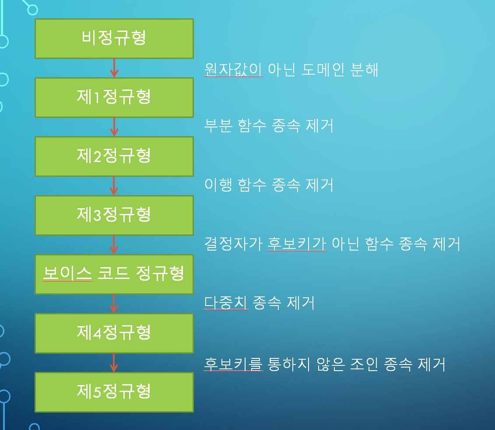
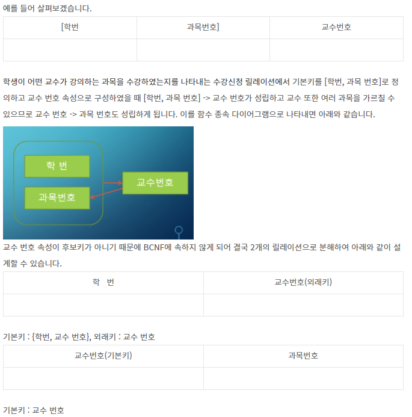

# DATABASE

**:Contents**
* [트랜잭션(Transaction) 이란](#트랜잭션이란)
* [트랜잭션 격리 수준(Transaction Isolation Level)](#트랜잭션-격리-수준)
* [트랜잭션 전파 방식(Transaction propagation)](#트랜잭션-전파-방식)
* [Index란](#index란)
* [Index를 타지 않는 경우](#Index를-타지-않는-경우)

---

### database pool(connection pool)
#### Connection Pool?
- 애플리케이션의 스레드에서 데이터베이스에 접근하기위해 Connection이 필요
- 데이터베이스와 Connection한 객체들을 미리 생성해 Pool에 저장해두었다가, 클라이언트의 요청이 들어올 때마다 사용/반환하는 방식

#### Connection Pool 데이터베이스 접근 과정
(1) 웹 컨테이너가 실행되면 데이터베이스와 연결된 Connection 객체들을 미리 생성해 Pool에 저장    
(2) 클라이언트 요청 시 Pool에서 Connection 객체를 가져와 데이터베이스 접근    
(3) 요청 처리가 끝나면 사용된 Connection 객체를 다시 Pool에 반환    

#### Connection Pool 장점    
- 매 연결마다 Connection 객체를 생성/제거하는 비용 감소    
- 미리 생성된 Connection 객체를 사용하므로 데이터베이스 접근 시간 단축    
- Connection 수를 제한해 부하 조정    

#### Connection Pool 단점  
- Connection 또한 객체이므로 메모리 차지    
- Connection 개수를 잘 못 설정할 경우, 쓸모없는 Connection이 발생할 수 있음

#### Connection이 부족할 경우
- 모든 Connection이 요청을 처리 중일 때, 해당 클라이언트의 요청을 대기 상태로 전환
- Pool에 Connection 객체가 반환되면 순차적으로 요청을 처리

#### Thread Pool과 Connection Pool
- Thread Pool은 작업 처리에 사용되는 스레드를 제한된 개수만큼 정해 놓고 작업 큐(Queue)에 들어오는 작업들을 하나씩 스레드가 맡아 처리하는 것
- WAS(Web Application Server)에서 Thread Pool과 Connection Pool의 Thread와 Connection의 수는 메모리와 직접적으로 관련이 있음
- Connection과 Thread 수를 많이 설정하면 메모리를 많이 차지하고, 반대로 적게 설정할 경우 처리하지 못하는 대기 요청이 많아짐

-----------------------------------------------
### 정규화(1차 2차 3차 BCNF)
#### 정규화(Normalization)란 하나의 릴레이션에 하나의 의미만 존재할 수 있도록 릴레이션을 분해해 나가는 과정
- 비정규형은 하나의 튜플에서 속성을 입력되는 도메인 값으로 여러 개의 값이 들어와서 원자성(Atomic)을 가지지 못한 경우
>  

- 제1 정규형 과정을 통해 원자값이 아닌 도메인을 분해하여 어떤 릴레이션 R에 속한 모든 도메인이 원자값으로만 되어 있도록 설계
>  

- 제2 정규형(Second Normal Form : 2NF)은 어떤 릴레이션 R이 제1정규화에 속하고 기본키에 속하지 않는 모든 속성이 키본키에 완전 함수적 종속이면 충족하는 정규화
>  

- 제3 정규형(Third Normal Form : 3NF)은 어떤 릴레이션 R이 제2정규화에 있으며 기본키에 속하지 않는 모든 속성이 기본키에 이행적 함수 종속이 아닌 상태의 관계
>  

- 보이스 코드 정규형(Boyce-Codd Normal Form : BCNF)은 릴레이션 R의 모든 결정자가 후보키이면 릴레이션 R은 Boyce-Codd 정규형에 속하는 상태.
>  

- BCNF 정규형에 속하는 릴레이션은 모두 제3 정규형에 속하지만 역으로는 성립되지 않는다는 점도 기억해 두어야 할 중요한 포인트

cf) https://minimax95.tistory.com/entry/%EC%A0%95%EA%B7%9C%ED%99%94Normalization-%EA%B0%9C%EB%85%90%EA%B3%BC-%EA%B8%B0%EB%B3%B8-%EA%B3%BC%EC%A0%95

-----------------------------------------------

### 트랜잭션
- 여러개의 작업이 발생할때 하나의 단위로 묶어 일괄 실행, 일괄 취소 할수있게 해주는것. 중간에 에러가 발생하면 없던일로 처리할 수 있다. 	
- 특성 
> 원자성(모두 실행되던지, 아니면 전혀 실행되지 않던지
> 일관성(실행전 내용 잘못되어있지 않으면 후에도 잘못되지 않아야한다)
> 고립성(다른트랜잭션 영향X)
> 지속성(영구적 저장)

### 트랜잭션 격리 레벨
#### 트랜잭션 격리 레벨
- 동시에 여러 트랜잭션이 진행될 때에 트랜잭션의 작업 결과를 여타 트랜잭션에게 어떻게 노출할 것인지를 결정하는 기준
- 스프링 DEFAULT : 사용하는 DB 드라이버의 디폴트 설정을 따른다. 대부분의 DB는 READ_COMMITTED를 기본 격리수준으로 갖는다. 

1. READ_UNCOMMITTED 
   - 가장 낮은 격리수준. 하나의 트랜잭션이 커밋되기 전에 그 변화가 다른 트랜잭션에 그대로 노출되는 문제가 있다. 
   - 하지만 가장 빠르기 때문에 데이터의 정합성이 조금 떨어지더라도 성능을 극대화할 때 의도적으로 사용함.
   - 각 트랜잭션의 변경 내용이 COMMIT / ROLLBACK 여부에 상관 없이 다른 트랜잭션에서 값을 읽을 수 있다.
   - COMMIT 되지 않은 상태지만, UPDATE 된 값을 다른 트랜잭션에서 읽을 수 있다.
	
2. READ_COMMITTED 
   - 실제로 가장 많이 사용되는 격리수준. 물론 스프링에서는 DEFAULT로 설정해둬도 DB의 기본 격리수준을 따라서 READ_COMMITTED로 동작하는 경우가 대부분이므로 명시적으로 설정하지 않기도 한다. 
   - READ_UNCOMMITTED와 달리 다른 트랜잭션이 커밋하지 않은 정보는 읽을 수 없다. 대신 하나의 트랜잭션이 읽은 로우를 다른 트랜잭션이 수정할 수 있다. 이 때문에 처음 트랜잭션이 같은 로우를 읽을 경우 다른 내용이 발견될 수 있다.
   -실제 테이블 값을 가져오는 것이 아니라 Undo 영역에 백업된 레코드에서 값을 가져온다.   
   -   
  
3. REPEATABLE_READ 
   - MySQL에서는 트랜잭션마다 트랜잭션 ID를 부여하여 트랜잭션 ID보다 작은 트랜잭션 번호에서 변경한 것만 읽게 된다.
   - Undo 공간에 백업해두고 실제 레코드 값을 변경한다.
   - 백업된 데이터는 불필요하다고 판단하는 시점에 주기적으로 삭제한다.
   - Undo에 백업된 레코드가 많아지면 MySQL 서버의 처리 성능이 떨어질 수 있다.
   - 하나의 트랜잭션이 읽은 로우를 다른 트랜잭션이 수정하는 것을 막아준다. 하지만 새로운 로우를 추가(insert)하는 것은 제한하지 않는다. 따라서 SELECT로 조건에 맞는 로우를 전부 가져오는 경우 트랜잭션이 끝나기 전에 추가된 로우가 발견될 수 있다.
   -   
   -   
      
4.SERIALIZABLE 
   - 가장 강력한 트랜잭션 격리수준. 트랜잭션을 순차적으로 진행시켜 주기 때문에 여러 트랜잭션이 동시에 같은 테이블의 정보를 액세스하지 못한다. 
   - 가장 안전한 격리수준이지만 가장 성능이 떨어지기 때문에 극단적인 안전한 작업이 필요한 경우가 아니라면 자주 사용되지 않는다.

#### Dirty Read & Non-Repeatable Read & Phantom Read    
* Dirty Read
> - 트랜잭션 작업이 완료되지 않았는데, 다른 트랜잭션에서 볼 수 있게 되는 현상

* Non-Repeatable Read
> - 한 트랜잭션 내에서 같은 쿼리를 두 번 수행했는데, 그 사이에 다른 트랜잭션이 값을 수정 또는 삭제함으로써 두 쿼리 결과가 다르게 나타나는 현상을 말한다.
 
* Phantom Read
> - 한 트랜잭션에서 같은 쿼리를 두 번 수행할 때, 첫 번째 쿼리에서 없던 레코드가 두 번째 쿼리에서 나타나는 현상
> - 한 트랜잭션이 수행 중일 때 다른 트랜잭션이 새로운 레코드를 INSERT 함으로써 나타난다.   
> - REPEATABLE_READ 격리 수준에서는 공유 잠금인 상태의 데이터에 대해 변경 불가가 보장되었다. 하지만, 그 데이터를 변경시키지 못할 뿐 새로운 데이터를 추가/삭제하는 것은 가능하다. 이것을 팬텀 읽기(Phantom read, 가상 읽기)라고 부른다
> - 트랜잭션 중에 없던 행이 추가되어 새로 입력된 데이터를 읽는 것 또는 트랜잭션 중에 데이터가 삭제되어 다음 읽기시 이전에 존재하던 행이 사라지는 것을 팬텀 읽기라고 한다.
 
  

cf)
https://nesoy.github.io/articles/2019-05/Database-Transaction-isolation    
https://mysqldba.tistory.com/334    
https://medium.com/@wonderful.dev/isolation-level-%EC%9D%B4%ED%95%B4%ED%95%98%EA%B8%B0-94e2c30cd8c9    

-----------------------------------------------------------------------
 
### 트랜잭션 전파 방식 
- 트랜잭션을 시작하거나 기존 트랜잭션에 참여하는 방법을 결정하는 속성	   
- REQUIRED: 현재 진행중인 트랜잭션이 있으면 그것을 사용하고, 없으면 생성한다. [DEFAULT 값]
- MANDATORY: REQUIRED와 비슷. 현재 진행중인 트랜잭션이 있으면 그것을 사용하고, 없으면 Exception 발생. 혼자서는 독립적으로 트랜잭션을 진행하면 안 되는 경우에 사용
- REQUIRES_NEW: 항상 새로운 트랜잭션을 시작. 
- SUPPORTS: 이미 진행중인 트랜잭션이 있으면 그것을 사용. 없으면 그냥 트랜잭션 없이 진행.
- NOT_SUPPORTED: 트랜잭션 사용하지 않게 한다. 이미 진행중인 트랜잭션이 있으면 보류
- NEVER: 트랜젝션을 사용하지 않도록 강제한다. 이미 진행중인 트랜잭션도 존재하면 안됨. 있다면 예외 발생
 
    @Transactional(propagation = Propagation.REQUIRES_NEW)
 	public void doSomething() { 
		
	}
