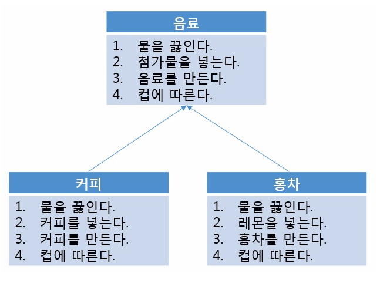
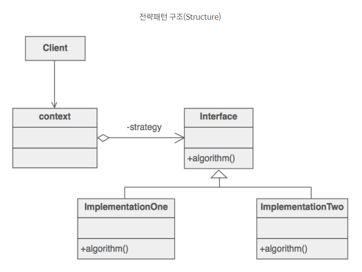
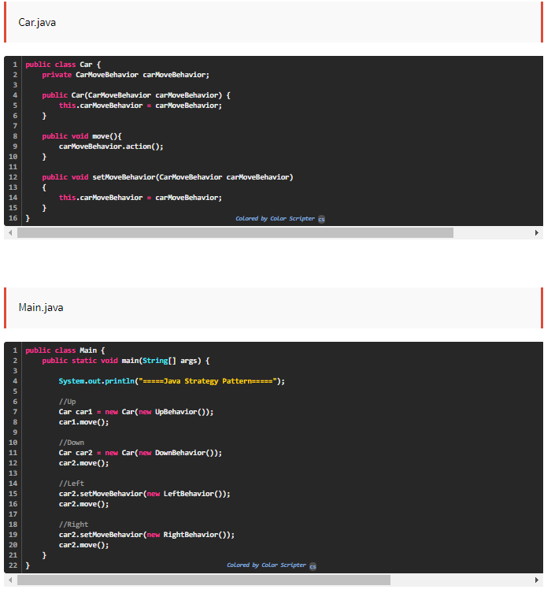
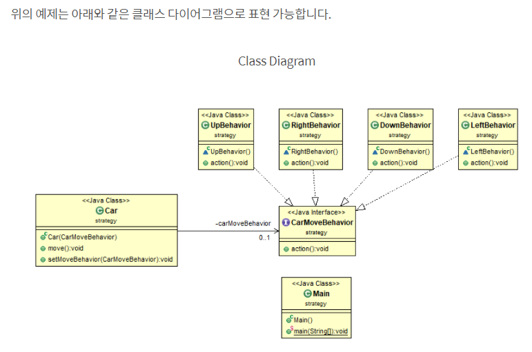
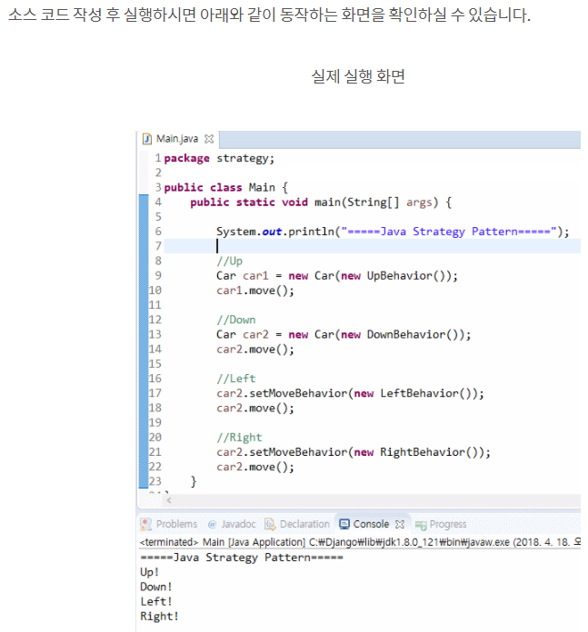
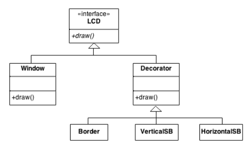
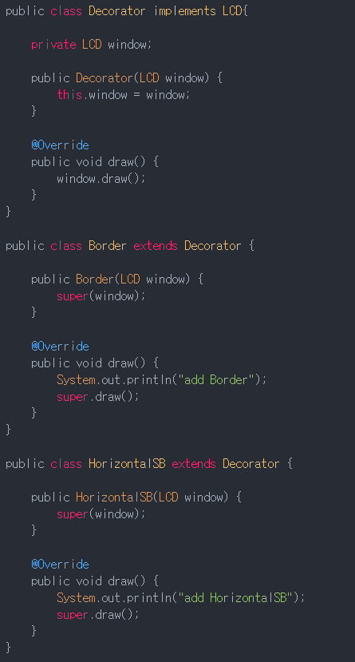
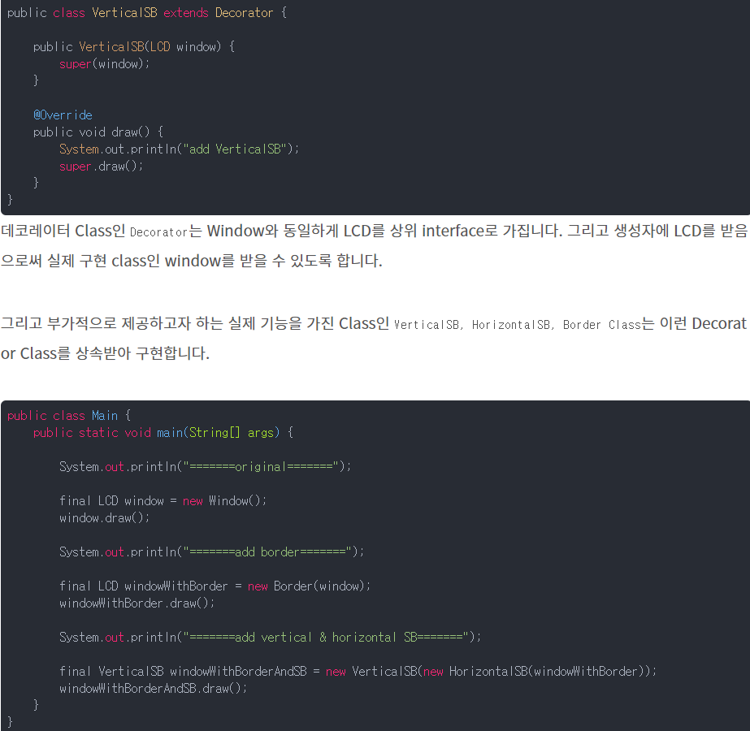
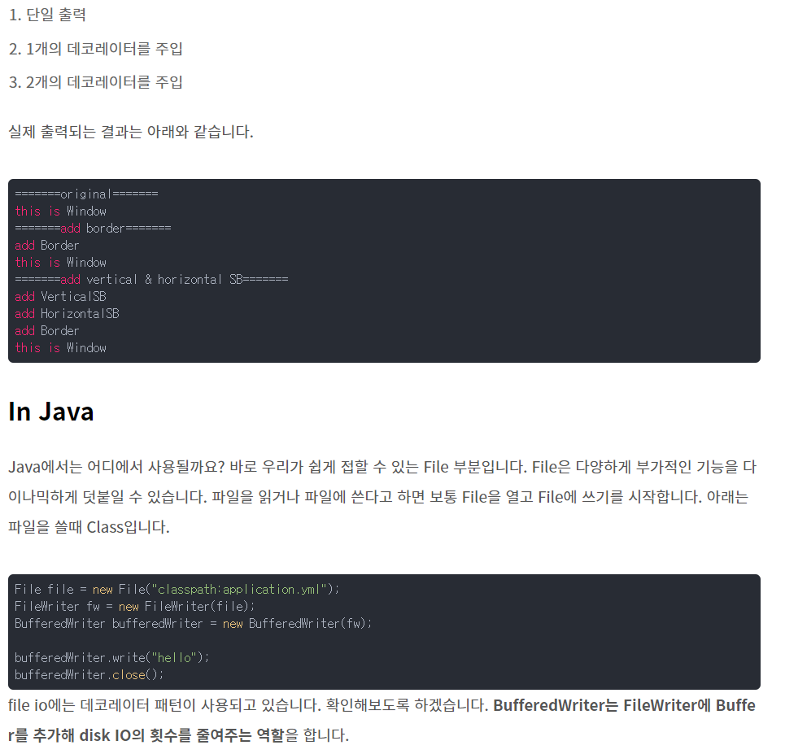

# Design pattern

**:Contents**
* [템플렛 메서드 패턴](#템플렛_메서드_패턴)
* [팩토리 패턴](#팩토리_패턴)
* [전략 패턴](#전략_패턴)
* [프록시 패턴](#프록시_패턴)
* [싱글톤 패턴](#싱글톤_패턴)
* [어댑터 패턴](#어댑터_패턴)
* [데코레이션 패턴](#데코레이션_패턴)

---


### 템플렛_메서드_패턴

* 템플렛_메서드_패턴이란

토비의 스프링에서는 아래와 같이 정의하고 있다.
>> 상속을 통해 슈퍼클래스의 기능을 확장할 때 사용하는 가장 대표적인 방법.<br>
 변하지 않는 기능은 슈퍼클래스에 만들어두고 자주 변경되며 확장할 기능은 서브클래스에서 만들도록 한다
 

아래의 예시의 생활에서 익숙한 예시이다.<br>




위의 구조를 아래의 구조와 같이 변경하는 것이 템플릿 메서드 패턴이다.<br>
공통된 기능은 그대로 사용하고 확장된 기능은 서브클래스에서 구현해주면 된다.


코드로 보면 아래와 같다.<br>
위에 음료에 대한 예시가 아닌 실제 자주 사용하는 코드에 대한 예시입니다.


`슈퍼 클래스`

```java

public abstract class AbstractCallTemplate{

    @Override
    public Map<String, Object> apiGetCall(String url) {
        RestTemplate restTemplate = new RestTemplate();
        HttpHeaders httpHeaders = new HttpHeaders();
        httpHeaders.setContentType(new MediaType("application", "json", Charset.forName("UTF-8")));
        Map<String, Object> response = restTemplate.getForObject(url, Map.class);
        return response;
    }

    public abstract String urlMake(Map<String, Object> params);

}

```

각 API호출시 request값들은 다르겠지만 api 호출은 동일하다.<br>
그래서 api호출을 하는 apiGetCall() 메서드는 추상클래스에 구현하여 사용하며 상황별로 다를 수 있는 request값들은 서블클래스에서 구현해 준다.<br>

`서브 클래스`

```java

@Component
public class SkeletonClient  extends AbstractCallTemplate {
    private final static Logger LOGGER = LoggerFactory.getLogger(SkeletonClient.class);
    private final static String RESOURCE = "http://api.corona-19.kr/korea/country/new/?";

    @Override
    public String urlMake(Map<String, Object> params) {
        String callUrl = "";
        if(!params.isEmpty()){
            callUrl = RESOURCE +"serviceKey="+ params.get("serviceKey");
        }
        return callUrl;
    }
}

```

`사용 클래스`


```java
@Component
public class SkeletonResponse {
    private final static Logger LOGGER = LoggerFactory.getLogger(SkeletonResponse.class);

    @Autowired
    private SkeletonClient skeletonClient;


    @Cacheable(value = "getSkeletonList" , keyGenerator = "skeletonKeyGenerator")
    public Map<String, Object> getList(){
        Map<String, Object> params = new HashMap<>();
        params.put("serviceKey","111111");
        String callUrl = skeletonClient.urlMake(params);
        Map<String, Object> lists = ists = skeletonClient.apiGetCall(callUrl);

        return lists;
    }
}
```


java8이상부터라면 인터페이스를 사용해도 될거 같은데 정리가 잘 된 사아트가 았어 남겨놨습니다.(아래의 출저 사이트를 참)


`출저`
https://yaboong.github.io/design-pattern/2018/09/27/template-method-pattern/

---


### 팩토리_패턴

객체를 생성하는 작업을 한 클래스에 캡슐화시켜 놓은 방식입니다.

* 구현을 변경해야 하는 경우에 여기저기 흩어져 있는 소스를 고칠 필요없이 팩토리 클래스만 수정하면 된다.

* 중복된 코드 제거


`생성해야 하는 객체 SkeletonClient , DemoClient`


```java

@Component
public class DemoClient extends AbstractCallTemplate {
    private final static String RESOURCE = "RESOURCE";

    @Override
    public String urlMake(Map<String, Object> params) {
        String callUrl = "";
        if(!params.isEmpty()){
            callUrl = RESOURCE;
        }
        return callUrl;
    }
}

```


```java

@Component
public class SkeletonClient  extends AbstractCallTemplate {
    private final static Logger LOGGER = LoggerFactory.getLogger(SkeletonClient.class);
    private final static String RESOURCE = "http://api.corona-19.kr/korea/country/new/?";

    @Override
    public String urlMake(Map<String, Object> params) {
        String callUrl = "";
        if(!params.isEmpty()){
            callUrl = RESOURCE +"serviceKey="+ params.get("serviceKey");
        }
        return callUrl;
    }
}

```

`객체 생성을 책임지는 factory class`

```java

@Service
public class ClientFactory {

    @Autowired
    @Qualifier("skeletonClient")
    private AbstractCallTemplate skeletonClient;

    @Autowired
    @Qualifier("demoClient")
    private AbstractCallTemplate demoClient;

    public AbstractCallTemplate getClient(String apiType){
        AbstractCallTemplate ret = null;
        switch (apiType){
            case "DM":
                ret = demoClient;
                break;
            case "ST":
                ret = skeletonClient;
                break;
            default:
                break;
        }

        return  Optional.ofNullable(ret)
                    .orElseThrow(() -> new NoSuchElementException(apiType+"에 해당하는 객체를 찾을 수 없습니다."));

    }
}


```


`factory를 통해 객체를 생성하 class`


```java

@Component
public class SkeletonResponse {
    private final static Logger LOGGER = LoggerFactory.getLogger(SkeletonResponse.class);

    @Autowired
    private ClientFactory clientFactory;


    @Cacheable(value = "getSkeletonList" , keyGenerator = "skeletonKeyGenerator")
    public Map<String, Object> getList(){
        AbstractCallTemplate client = clientFactory.getClient(ApiType.SKELETON_TYPE.getApiTypeCode());
        Map<String, Object> params = new HashMap<>();
        params.put("serviceKey","");

        String callUrl = client.urlMake(params);
        Map<String, Object> lists = client.apiGetCall(callUrl);

        return lists;
    }
}

```

---


### 전략 패턴
#### 전략 패턴이란?
- 전략패턴은 각각의 알고리즘군을 교환이 가능하도록 별도로 정의하고 각각 캡슐화 한 후 서로 교환해서 사용할 수 있는 패턴이며, 아래와 같은 장점이 있습니다.
>- 코드 중복 방지
>- 런타임(Runtime)시에 타겟 메소드 변경
>- 확장성(신규 클래스) 및 알고리즘 변경 용이

- 알고리즘군을 정의하고 각각을 켑슐화하여 교환해서 사용할 수 있도록 만드는 방식
- Strategy 패턴을 활용하면 알고리즘을 사용하는 클라이언트와는 독립적으로 알고리즘을 변경할 수 있다.
- 즉 알고리즘의 인터페이스(API) 부분만 규정해서 변경해서 사용할 수 있도록 하는 것을 전략 패턴[행동 자체를 구현이 아닌 inteface(API)로 정의해 사용하는 방식]이라 한다.

#### JAVA 전략 패턴 구조 
  
- Strategy(전략) : 전략 사용을 위한 인터페이스 생성
- ImplementationOne, ImplementationTwo : Strategy 인터페이스를 구현한 실제 알고리즘을 구현
- Context : 인스턴스를 주입받아 직접 사용하는 역할

#### JAVA 전략 패턴 -예제 소스 코드 
  
  

#### JAVA 전략 패턴 -클래스 다이어그램(UML) 및 예제 실행
  

  

##### cf) ** 전략 패턴과 템플릿 메소드 패턴
>- 전략패턴은 템플릿 메소드 패턴과 유사할 겁니다.    
>  템플릿 메소드 패턴은 반드시 추상 클래스의 템플릿 메서드에서 구현클래스의 메서드를 부르는 식으로 로직을 구성해야 합니다[(상위->하위)]    
   상속을 이용하는 템플릿 메서드 패턴과 객체주입을 통한 전략패턴 중에서 고민해보고 적용하면 됩니다.    
   단일 상속만이 가능한 자바에서 상속이라는 제한이 있는 템플릿 메서드 패턴보다는 다양하게 많은 전략을 implements할 수 있는 전략패턴이 많이 사용됩니다.    
   전략 패턴을 한마디로 정리하면, "클라이언트가 전략을 생성해 전략을 실행할 컨텍스트에게 주입하는 패턴이다."

- Strategy 패턴: 알고리즘을 구성으로 사용.유연성 o
- Template Method 패턴: 알고리즘을 서브클래스[하위]에서 일부 지정할 수 있으면서 재사용이 가능, 하지만 의존성이 크다는 문제가 발생. 재사용 o

>출처 : https://niceman.tistory.com/133

##### cf) 캡슐화    
>- 객체의 필드(속성), 메소드를 하나로 묶고, 실제 구현 내용을 외부에 감추는 것을 말한다.
>- 외부 객체는 객체 내부의 구조를 얻지 못하며 객체가 노출해서 제공하는 필드와 메소드만 이용할 수 있다.
>- 필드와 메소드를 캡슐화하여 보호하는 이유는 외부의 잘못된 사용으로 인해 객체가 손상되지 않도록 하는데 있다.
>- 자바 언어는 캡슐화된 멤버를 노출시킬 것인지 숨길 것인지를 결정하기 위해 접근 제한자(Access Modifier)를 사용한다.

------------------------------------------------

### 프록시 패턴
프록시(Proxy)는 우리 말로 대리자, 대변인이라는 뜻을 가지고 있다. 대리자 대변인은 다른 누군가를 대신해 그 역할을 수행하는 존재이다.
프로그램에서 봤을 때도 같은 맥락이다. 프록시는 어떤 일을 대신시키는 것이고 구체적으로 인터페이스를 사용하고 실행시킬 클래스에 대한 객체가 들어갈 자리에
대리자 객체, 그러니까 프록시 객체를 대신 투입해 클라이언트 쪽에서 요청했을 때 바로 그 객체에 대한 처리를 하는 것이 아니라 대리자 객체를 통해 메서드를 호출하고
반환 해주는 역할을 합니다.  

  
프록시는 일종의 비서역할을 한다고 생각하면 된다. 실제 작업을 하는 Object 를 감싸서, 실제 Object 를 요청하기 전이나 후에 인가처리(보호), 생성 자원이 많이 드는 작업에 대해
백그라운드 처리(가상), 원격 메서드를 호출하기 위한 작업(원격) 등을 하는데 사용한다.  
  
중요한 것은 프록시는 흐름제어만 할 뿐 결과 값을 조작하거나 변경시키면 안된다는 것이다. 우리가 비서에게 대신 연락처 목록을 정리해서 달라고 지시했다면, 그 연락처 목록을 정리한 결과를 줘야하지,
비서가 마음대로 그 연락처를 수정하거나 하면 안되는 것처럼 말이다.

프록시를 UML 로 표현하면 다음과 같다.


  
  
>출처 : https://limkydev.tistory.com/79

클라이언트가 어떤 일에 대한 요청(RealSubject 의 request() 메서드 호출)을 하면, Proxy 가 대신 RealSubject 의 request() 메서드 호출을 하고 그 반환 값을 클라이언트에 전달한다.  
  
코드로 나타내면 다음과 같다.  
  

  

  
  

  
>출처 : https://velog.io/@max9106/Spring-%ED%94%84%EB%A1%9D%EC%8B%9C-AOP-xwk5zy57ee
  

이렇게 프록시가 실제 서비스 클래스의 메서드를 호출하여 반환해주는 것을 볼 수 있다. 또한 또 다른 로직 처리를 해줄 수도 있다. 이러한 프록시 패턴을 보면 Spring AOP 에 대해 말하지 않을 수 없다.
위처럼 프록시 클래스를 따로 두고 @Primary 어노테이션을 통해 프록시 패턴을 사용하면 원래 서비스 클래스에 코드를 추가하지 않고도 다른 기능을 넣어줄 수 있지만, 중복 코드가 발생할 수 있고,
다른 클래스에서도 동일한 기능을 사용하고자 한다면, 그 또한 매번 코딩을 해줘야하는 점에서 효율적이지 못하다.  
  
이러한 문제를 해결해 주는 것이 스프링 AOP 이다. AOP 는 @Aspect 어노테이션을 통해 만들수 있다. 또한 @Around, @Before, @After 등의 어노테이션을 통해 해당 함수들의
전, 후의 실행시점을 자유롭게 설정해줄 수 있다. 그래서 일반적으로 로깅, 트랜잭션과 같은 처리를 AOP 를 활용하는 경우가 많다.  
  
어쨋든 AOP 를 설명하고자 하는 것은 아니기에 AOP 에 대해 더 궁금하다면 직접 찾아보도록 하고, 끝으로
프록시 패턴은 정말 많은 곳에서 사용되고 있고 응용할 곳도 많은 패턴인 듯 하니 숙지하고 있는 것이 좋은 패턴인듯 하다.

------------------------------
### 어댑터 패턴

* 한 클래스의 인터페이스를 클라이언트에서 사용하고자 하는 다른 인터페이스로 변환합니다.<br>
어댑터를 이용하면 인터페이스 호환성 문제 때문에 같이 쓸 수 없는 클래스들을 연결해서 쓸 수 있다.

 


아래의 예시를 통해 설명해보자면.
`어댑터 패턴 예시`
* client에서 기존에 Math클래스를 사용하고 있음 
* 2가지의 기능(연산)을 수행하는 `Adapter` 객체를 만들거임
 - 수의 두배의 수를 반환 : twiceOf(Float)
 - 수의 반(1/2)의 수를 반환 : halfOf(Float)
 
 
`Math class`

```java

public class Math {
    public static double twoTime(double num){return num*2;}
    public static double half(double num){return num/2;}
}

```

`Adapter interface`

```java

public interface Adapter  {
    public Float twiceOf(Float num);
    public Float halfOf(Float num);
}

```

`Adapter interface 구현체`

```java

public interface AdapterImpl implements Adapter {
    
    @Override
    public Float twiceOf(Float num){
        return (float)Math.twoTime(num.doubleValue());
    }
    
    @Override
    public Float halfOf(Float num){
        return (float)Math.half(num.doubleValue());
    }
}

```


`Adapter interface 구현체`

```java

public class Task01 {
    public static void main(String[] args) {
        
        Adapter adapter = new AdapterImpl();
        System.out.println(adapter.twiceOf(100f));
        System.out.println(adapter.halfOf(80f));
    }
}

```


>> 결론은 기존의 클래스인 Math클래스는 건드리지지 않고 float타입으로 들어오는 값을 AdapterImpl을 통해 요구사항맞게
double형에 변환하여 사용하였습니다.
>> 프로젝트가 운영된지 어느 시점이 지난 상황에 새로운 요구사항이 들어왔을 경우 adapter class를 통해
기존에 사용하는 클래스는 그대로 사용하면서 요구사항에 맞는 기능을 구현할 수 있게 도와준다.


>> 개인적인 의견으로는 새로운 프로젝트를 개발하는 경우보다는 운영하면서 다양한 요구사항에 맞게 기능을 추가하는 경우
많이 사용할 수 있는 패턴으로 보입니다.
 


------------------------------
### 데코레이터 패턴

- Target Class에 부가적인 기능을 런타임 시 다이나믹하게 부여해주기 위해 Proxy를 사용하는 패턴
- 다이내믹하게 기능을 부가한다는 의미는 컴파일 시점, 즉 코드상에서는 어떤 방법과 순서로 프록시와 타깃이 연결되어 사용되는지 정해져 있지 않다는 뜻
- 즉, 데코레이터 패턴은 런타임중 다양하게 기능을 추가 할 수 있다라는 뜻입니다
- runtime에 real Object에 기능을 확장하고 싶을 때 사용합니다. 이렇게 분리된 부가기능을 담은 클래스는 중요한 특징이 있습니다. 
- 부가기능 외의 나머지 모든 기능은 원래 핵심기능을 가진 클래스로 위임해줘야 합니다. 핵심기능은 부가기능을 가진 클래스의 존재 자체를 모른다. 따라서 부가기능이 핵심기능을 사용하는 구조가 되는 것입니다.

#### 데코레이터 패턴과 프록시 패턴
##### 프록시 패턴
- Real Object에 대해서 실제로 필요할 때 instance가 생성되고 실제 작업이 진행될 수 있도록 하기 위해 적용되는 패턴입니다.
- 프록시 패턴에서 Real Object는 Proxy가 감싸고 있으며, Proxy를 통해서 처음 접근 또는 요청이 있을 때 생성이 되어집니다. Proxy는 Client가 적절한 권한이 있는지 검사 하기도하며 client의 요청을 컨트롤합니다.
- 적절하게 만들어진 Proxy 패턴은 Client가 사용할 때는 해당 Real Object를 만들고 사용하지 않을때는 메모리를 해제하는 등의 작업을 하기도 합니다.
##### 데코레이터 패턴과 프록시 패턴의 공통점
- class의 구조가 비슷합니다. 둘다 동일한 Interface를 구현합니다. 그리고 Wrapper Class와 real class의 관계가 aggregation 즉, has A 관계를 띄고 있습니다.
##### 데코레이터 패턴과 프록시 패턴의 차이점
- 프록시 패턴에서는 Wrapper Class와 Real Class의 관계가 컴파일타임에 정해집니다. 반면 데코레이터 패턴에서는 런타임에 정해지도록 되어있습니다.
- 그리고 프록시 패턴은 Real Class의 접근에 대한 제어를 목적으로하며, 데코레이터 패턴은 Real Class의 기능에 다른 기능을 추가하는 목적으로합니다.

#### 데코레이터 패턴 예제
##### 데코레이터 패턴 적용 전

- cf) https://sourcemaking.com/design_patterns/decorator
- 윈도우 시스템을 만든다고 가정해보겠습니다. (세로스크롤, 가로스크롤, 외곽선이 있는 웹브라우저)
하지만 이런식으로 설계한다고 하면 문제점이 있습니다. 바로 기능의 추가때마다 상속구조가 복잡해진다는 것입니다
데코레이터 패턴을 사용한다면 이러한 문제를 유연하게 대응할 수 있게됩니다. 
##### 데코레이터 패턴 적용 후

- cf) https://sourcemaking.com/design_patterns/decorator
Window라는 Target Class의 메서드에 Decorator의 메서드를 붙여서 부가기능을 추가할 수 있습니다. 






 
- cf) https://sabarada.tistory.com/60?category=800572
- cf) https://sabarada.tistory.com/59


