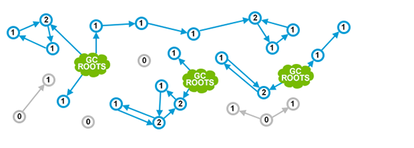
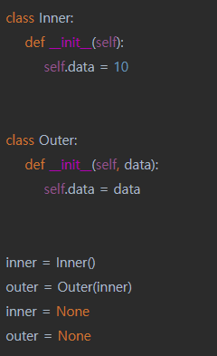
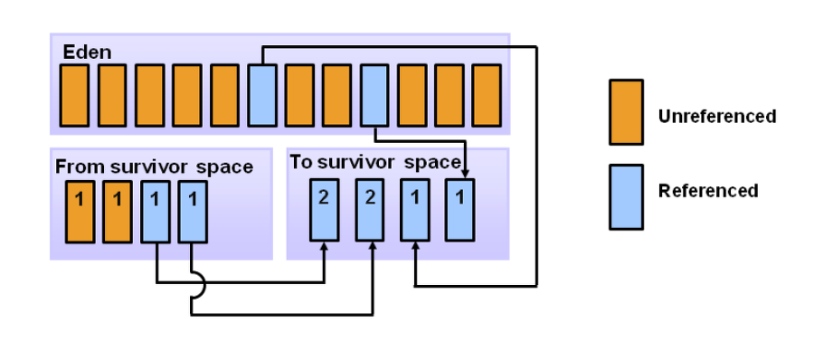
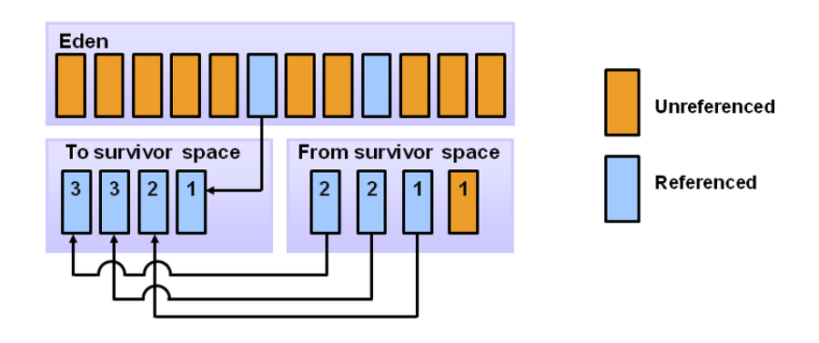
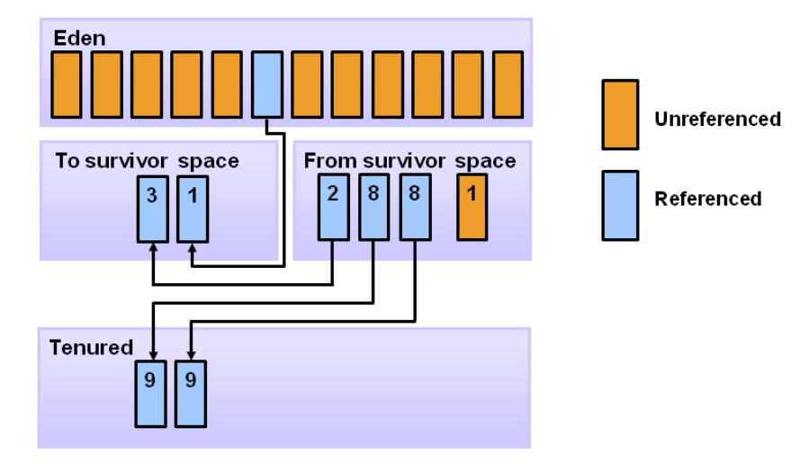
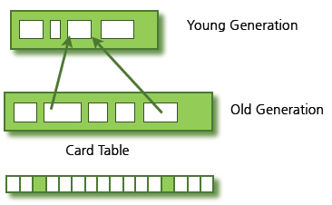
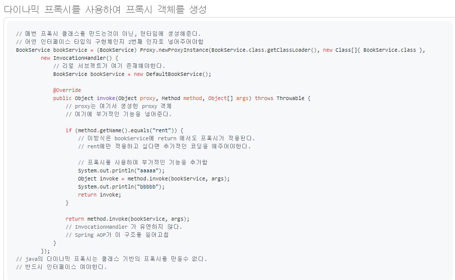
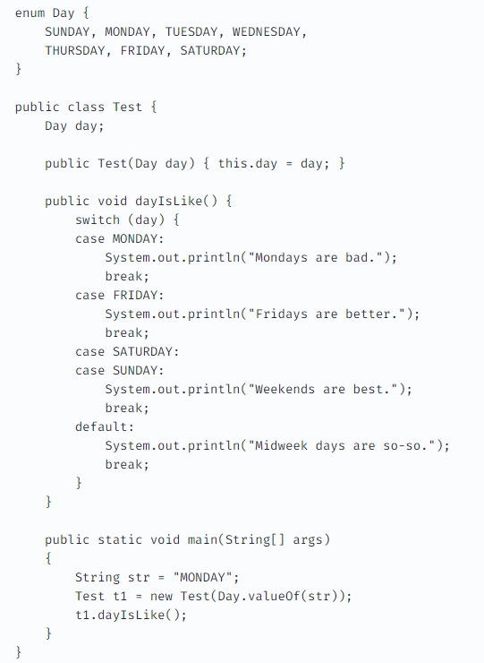
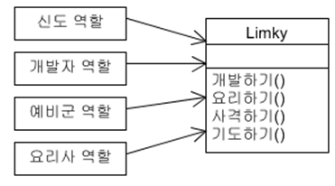

# Java

**:Contents**
* [컴파일 과정을 말해보라] 
* [interface와 abstract class차이]
* [캡슐화와 은닉화? 차이는 무엇인가?]
* [String, StringBuilder, StringBuffer의 차이는]
* [JAVA의 Garbage Collector는 어떻게 동작하는지.]

* [자바 다이나믹 프록시]
* [enum 이란]
* [자바에서 == 와 Equals() 메서드의 차이는]
* [java의 접근 제어자의 종류와 특징]
* [Java SE와 Java EE 애플리케이션 차이]

* [java의 final 키워드 (final/finally/finalize)]
* [리플렉션이란]
* [Wrapper class]
* [OOP의 4가지 특징]
추상화(Abstraction), 캡슐화(Encapsulation), 상속(Inheritance), 다형성(Polymorphism)
* [OOP의 5대 원칙 (SOLID)]

* [java의 non-static 멤버와 static 멤버의 차이]
* [java의 main 메서드가 static인 이유]
* [Annotation]
* [java 직렬화(Serialization)와 역직렬화(Deserialization)란 무엇인가]
* [JVM 구조]

* [클래스, 객체, 인스턴스의 차이]
* [객체(Object)란 무엇인가]
* [Call by Reference와 Call by Value의 차이]
* [제네릭에 대해 설명해주시고, 왜 쓰는지 어디세 써 봤는지 알려주세요.]
* [CheckedException과 UnCheckedException의 차이를 설명하시오.]

* [Java Collections Framework]
java Map 인터페이스 구현체의 종류 ,java Set 인터페이스 구현체의 종류 ,java List 인터페이스 구현체의 종류
* [HashMap vs HashTable vs ConcurrentHashMap의 차이를 설명하시오.]
* [깊은복사 , 얇은복사의 차이]
* [동기화와 비동기화의 차이(Syncronous vs Asyncronous)]
* [Stream이란]

* [Lambda란]
* [자바에 함수형 인터페이스에 선언문이 하나인 이유]
* [new String()과 ""의 차이에 대해 설명해주세요.]
* [오버로딩과 오버라이딩의 차이]

---

### 컴파일 과정


1. 개발자가 .java파일을 생성한다.
2. build를 한다.
3. java compliler의 javac의 명령어를 통해 바이트코드(.class)를 생성

4. class loader를 통해 jvm내로 로드
5. 실행엔진을 통해 컴퓨터가 읽을 수 있는 기계어로 해석되어(각 운영체제에 맞는 기계어)<br>
 Runtime Data Area에 배치

`실행엔진`
* 실행 엔진은 바이트코드를 명령어 단위로 읽어서 실행하는데, 두 가지 방식을 혼합하여 사용한다. 

* Interpreter 방식
>> 바이트코드를 한 줄씩 해석, 실행하는 방식이다. 초기 방식으로, 속도가 느리다는 단점이 있다.

* JIT(Just In Time) 컴파일 방식 또는 동적 번역(Dynamic Translation)

>> 그래서 나온 것이 JIT(Just In Time) 컴파일 방식이다. 
>바이트코드를 JIT 컴파일러를 이용해 프로그램을 실제 실행하는 시점(바이트코드를 실행하는 시점)에 각 OS에 맞는 Native Code로 변환하여 실행 속도를 개선하였다. 
>하지만, 바이트코드를 Native Code로 변환하는 데에도 비용이 소요되므로, JVM은 모든 코드를 JIT 컴파일러 방식으로 실행하지 않고, 인터프리터 방식을 사용하다 일정 기준이 넘어가면 JIT 컴파일 방식으로 명령어를 실행한다. 

*** 또한, JIT 컴파일러는 같은 코드를 매번 해석하지 않고, 실행할 때 컴파일을 하면서 해당 코드를 캐싱해버린다. 이후에는 바뀐 부분만 컴파일하고, 나머지는 캐싱된 코드를 사용한다.** 

`출저`
https://blog.naver.com/software705/220645590756


### interface와 abstract class

`외형적 차이점`

`확장성`
* 인터페이스(be able to)
생성자를 가질 수 없어 객체화가 불가능<br>
디폴트 메서드 + 추상메서드로 구성<br>
다중 상속이 가능<br>


`추상화`
* 추상클래스(is a kind of)
생성자를 가지기 때문에 객채화가 가능<br>
필드를 가질 수 있다<br>
다중 상속 불가<br>

>> 외형적인 차이보다는 상용의 의도가 중요하다.

* 차 is a kind of 탈것
* 자전거 is a kind of 탈것
* 기차 is a kind of 탈것
* 버스 is a kind of 탈것

위와 같이 탈것에는 타는 종류의 필드이름과 탄다는 메서드가 공통으로 있을 것이다.<br>
이런 공통된 부분을 추상화 한 것을 추상클래스라고 한다.<br>


스프링을 통해 개발을 하면 service interface => serviceImpl class 이런식으로<br>
개발하는 패턴을 많이 봤을텐데 1개의 구현체만 만들고 과제가 끝난 경우가 많았을 것이다.<br>

그러면서 굳이 인터페이스를 사용해야한지도 의문이 들었을 것이다.<br>

나중에 확정성을 고려하여 이렇게 개발하는 것이라고 한다.<br>

ex) . paymentService => kbPaymentServiceImpl , lgPaymentServiceImpl
처음은 kb결제로 시작해서 LG결제등의 다른 결제 추가될 가능이 있다면 인퍼페이스를 사용하는게 적절하다.

그렇가면 더이상 확장될 가능성이 없다면 service interface => serviceImpl class 구조로 
개발할 필요가 없다.

>> 인터페이스를 사용하는 이유를 협업이라고 하기도한다.
> 하나의 규격을 만들어 놓으면 A개발자가 kbPaymentServiceImpl 개발을 / B개발자가 lgPaymentServiceImpl 개발을  협업이 가능하다.


### 캡슐화와 은닉화

`캡슐화는 관련된 요소들을 묶음으로써 캡슐 내부와 외부를 구별 짓는 장치`

관련된 요소들을 묶음 : 캡슐화란 데이터(속성)과 데이터를 처리하는 함수를 하나로
내부와 외부를 구별 : 객체 외부에서는 개체 내부 정보를 직접 접근하거나 조작할 수 없고,<br>
외부에서 접근할 수 있도록 정의된 오퍼레이션을 통해서만 관련 데이터에 접근할 수 있다
ex). getter ,setter

- 객체의 세부내용이 외부에 은폐(정보은닉)되어, 변경이 발생할 때 오류발생이 적어짐
- 각 객체가 가지고 있는 데이터들은 해당 객체 속에 숨어 있기 때문에 외부 객체에서 볼 수 없다.
- 객체들 간의 메시지를 주고 받을 때 각 객체의 세부 내용은 알 필요가 없으므로 인터페이스가 간결해지고, 객체간의 결합도가 낮아짐


`정보은닉은 캡슐내의 요소들에 대한 세부 구현사항을 외부에 숨기는 장치`

정보 은닉은 private 키워드를 활용해서 외부에서 클래스 내부의 정보에 접근하지 못하도록 하는 기능을 말합니다.

- 정보은닉은 캡슐화 되어 있는 데이터와 함에 대해서 외부에서 해당 함수가 어떻게 구현되어 있는지에 대한 세부 사항을 숨기는 것이다.
- 캡슐화가 되어 있다고 해서 반드시 정보은닉이 되는 것은 아니다.


### String, StringBuilder, StringBuffer의 차이는

* String 객체(불변)
불변이기 때문에 변하지 않는 문자열은 String을 사용한다.

>> 변하지 않은 문자열을 저장할때 적합 

* StringBuilder(가변)
비동기방식이기 때문에 Single Thread 환경하에서, 변화되는 문자열의 사용한다.
동기방식이기 때문에 처리속도는 제일 빠르다.

* StringBuffer(가변)
동기방식으로 저장되기 때문에 멀티쓰레드로 접근하거나 문자열이 변경될 경우에 사용한다.


>> 이 질문의 의도는 동기 , 비동기의 기준으로 보입니다.


------------------------------------------------------------

### JAVA Garbage Collector 동작 과정
#### GC의 기본원리
우리의 메모리는 유한한 자원이다. 메모리는 할당이 있으면 반드시 해제가 있어야 한다.
우리가 프로그램을 켜놓으면 켜놓을수록 메모리 점유율이 올라가는 것을 볼 수 있는데 이는 제때 해제해주지 않고, 계속 메모리에 쌓여서 그런것이다.
이러한 것을 메모리 누수(Memory leak) 이라고 부른다.  
  
하지만 C나 C++ 을 짜본 사람이라면 알겠지만 이는 쉬운 일이 아니다. 물론 메모리 누수는 프로그램을 종료하면 모두 사라지지만 그렇다고 서버를 
껐다가 킬수 있는 용기있는 개발자는 없을 것이다. 그래서 C나 C++로 프로그래밍을 하면서 메모리 테이블을 만들기 시작한 것이 GC 의 시작이다.  
  
우선 우리는 두가지 방법의 Garbage 선정 알고리즘에 대해 알아보자.
### Reference Counting
개수를 꾸준히 세면된다 라는 발상에서 나온 방식이다.  
  
   
  
가장 간단한 발상이다. 하지만 강력하고 많이 쓰이는 방식이다. 쉽게 말해 개수를 세는 것이다.
다음 코드를 보자.  
  
  
  
해당 예제는 python 으로 짠 코드이다. 이유는 python 이 Reference Counting 방식을 쓰기 때문이다.
그럼 어떤 식으로 동작하는지 보자.  

> inner = Inner()  
  
이 코드를 통해 inner() 는 inner 와 연결되어 있다. 즉 자신을 참조하는 녀석이 1개이므로 reference counting (이하 rc)는 1이 된다.  
  
> outer = Outer(inner)  
  
이 코드로 통해 Outer(inner) 는 outer 와 연결되어 참조하는 녀석이 1이 된다. 반면 inner() 는 다시 Outer(inner) 와 연결되므로 rc가 2로 증가된다.  
  
> inner = None  
  
이제 inner 는 null 이 되므로 Inner() 의 rc는 다시 1로 감소한다. 하지만 아직 gc 의 대상은 아닌데 아직 Outer(inner)가 참조하고 있기 때문이다.  
  
> outer = None  
  
여기서 outer 는 null 이 되므로 Outer(inner) 의 rc 는 0이 된고 gc의 대상이 된다. 또한 Inner() 역시 rc가 0이 되므로 gc의 대상이 된다.  
  
이와 같은 reference counting 방식은 장점과 단점이 존재한다.  
  
+ reference 의 증감을 카운팅해야하기 때문에 갱신이 필요하다.
+ 순환참조를 알아낼 수 없다.
+ 컴파일 시간에 적용하기 용이하다.

마지막 컴파일 시간에 쓰기 용이한 이유는 reference 를 굳이 카운팅하지 않아도 미리 컴파일 시간에 변수들을 다 찾아내어 해제하는 로직이 가능하다.
이를 이용한 방식이 바로 swift 이다.  
  
하지만 가장 큰 단점은 두 번째에 적혀있는 순환참조를 알아낼 수 없다는 것이다.
이는 Java 에서 reference counting 을 포기하게 된 이유이기도 하다.
왜 문제가 되는지 다음 코드를 보자.  
  
  
  
코드를 보면 a는 b를 가르키고 b는 a를 가르킨다.  
마지막에 둘다 None 을 가르키는 것 같지만 사실은 Node(10, None)과 Node(20, a) 이 서로 참조하고 있는 것을 알 수 있다.
그래서 a와 b를 지워도 rc는 0이 되지 않고, 결국 영원히 메모리에 상주하고 있게 된다는 것이다.  
  
### Mark-Sweep 알고리즘
reference counting 의 순환 참조를 알아낼 수 없는 단점때문에 등장한 것이 Mark Sweep 알고리즘이다. 자바에서 GC 가 동작하는 원리는
그다지 간단하지 않은데 그 이유는 Mark-Sweep 알고리즘을 사용하기 때문이다.
물론 자바에는 실제로 여러종류의 GC가 있지만 기본 베이스는 이 알고리즘으로 되어있다.

> 사용하는 reference 를 표시(Mark) 하고 표시가 안된 녀석을 쓸어 담아 청소(Sweep)한다.  
  
그렇다면 사용하는 레퍼런스를 선택하는 원리는 무엇일까? 자바에서 reference 를 가질 수 있는 경우는 딱 네가지이다.  
  
  
  
> 1. 각각의 thread 의 stack 에 있는 변수가 가리키는 reference
> 2. Method 영역의 정적 변수가 가르키는 reference
> 3. native 를 돌리는 thread 에서 native stack 이 가리키는 reference
> 4. 1,2,3 이 가리키는 reference  
  
4번의 경우에는 무조건 적으로 자신을 가르키는 더 상위 객체가 존재하게 된다.  
그러나 1, 2, 3번의 경우 반드시 최상위 노드가 되는데(자기 자신보다 상위 개체가 없음) 이러한 최상위 진입점을 Root Set 이라고 부른다.  
  
  
  
Root Set 부터 그래프 구조를 순회하면서 모조리 마크하면서 다니면 된다. 이렇게 마킹된 녀석들을 Reachable Objects 라고 부르고, 반대로
마킹된 녀석들을 제외한 녀석들을 Unreachable Objects 라고 부른다.  
즉, mark-sweep 알고리즘은 이 마킹 안된 녀석들을 모조리 쓸어담아 없애면 된다는 것이다.
하지만 사실, 이 알고리즘에도 몇 가지 문제점이 있다.  
  
> 1. 커지면 시간이 너무 오래 걸린다.
> 2. 메모리 단편화가 진행된다.  
  
일단 1번부터 살표보면, GC는 당연히 메모리가 부족할 때 발생한다. 그렇다면 모든 메모리가 부족할 때가 되서야 Full scan 을 하는 것은 매우 비효율적이라는 것이다.
그래서 여러가지 변종 알고리즘들이 존재하게 되었다.

  
  
jvm 의 heap 영역은 개략적으로 위와 같다. 물론 jdk 8 이 되면서 펌 영역이 native 영역으로 옮겨지고 이름이 metaspace 로 바뀌었다.  
어쨋든 크게 Young, Old, Perm 영역으로 분류되고 Young 은 다시 eden, s0, s1 영역으로 분류된다.  
+ Young 영역 : 비교적 젊은 reference 가 살아있는 영역
> + eden : Young 영역 중에서도 방금 막 생성된 녀석들이 오는 곳
> + survive : eden 에서 생존한 녀석들이 당분간 생존해 있는 곳
+ Old 영역 : 특정 횟수 이상을 살아남은 reference 가 살아있는 영역
+ Perm 영역 : Method Area 의 메타 정보가 기록된 곳  
  
이렇게 영역을 나눈 이유는 Full GC를 막기 위해서이다. Full GC는 모든 Heap 영역을 뒤져서 생존해 있는 모든 녀석들을 죽이는 것인데
당연하겠지만 시간이 오래걸린다. 그래서 GC는 세가지 단계로 나눠져있다.  
  
+ Minor GC - Young 영역만 뒤져서 죽일때 발생되는 GC
+ Major GC - Old 영역까지 뒤져서 다 죽일때 발생하는 GC
+ Full GC - Perm 영역까지 전부 뒤져서 죽일 때 발생되는 GC  
  
그럼 하나씩 살펴보자.
### Minor GC
이 Minor GC 에서 발동되는 알고리즘을 Stop And Copy 알고리즘이라고 한다.  
  
young 영역을 보면 eden 과 두 개의 survive 로 나뉘고 두 개의 영역 중 하나만을 사용한다. 즉 하나는 반드시 비어둔다.  
  
  
먼저 Eden 영역은 새로 들어오는대로 적재한다.

  
  
그리고 위 상황처럼 Eden 이 가득 차면 Minor GC가 발생된다. mark-sweep 을 실행하지만 전 영역을 실행하는 것이 아니라 Young 영역만 검사하게 된다.  
그렇다면 궁금해지는 것이 __그럼 Old 가 Young 을 참조하고 있는 경우는 어떻게 되느냐__ 이다. 아래 그림을 보자
  
  
  
마킹이 끝나면 죽을 녀석들은 죽이고 살릴 녀석들은 count 를 증가시켜서 살린다.
  
  
그리고 여기서 또 가득차서 GC가 발생할 경우 survive 영역의 모든 변수는 카운트를 1 증가시키고 Eden 역시 1 증가 시킨다. 그리고 반대편 survive 영역에
몰아 넣게 되는데 이는 메모리 단편화를 막기 위해서이다.  
  
  
  
그리고 GC가 발생될 경우 이러한 것을 반복한다.  
    
  
  
그리고 알고리즘 작동 중 survive 에 있는 녀석들 가운데 카운트 값이 임계값이 넘어간 녀석들은 Old 영역으로 승격이 된다.
위 그림에서는 8이 임계값이지만 Oracle 에서 사용하는 HotSpot JVM 에서는 31이 default 값이며 수정도 가능하다.
  
쉽게 말해 오래 살아 남았으니 앞으로도 죽을 일이 별로 없겠지? 라는 뜻으로 이동시키고 더 이상 보지않겠다는 것이다.
Stop And Copy 알고리즘은 GC의 빈도를 높여 청소작업을 여러 번 해줌으로써 사용자로 하여금 프로그램이 정지되는 경험을 주지 않게 하고 단편화 역시 해결해주는 좋은 알고리즘이다.  
이는 아래와 같은 두 가지의 전제가 밑바탕되기 때문이다.

> 1. 대부분의 객체는 생성되고 나서 얼마 지나지 않아 unreachable 하게 된다.(GC의 대상이 된다.)
> 2. 오래된 객체는 젊은 객체를 적게 참조한다.  
  
1번으로 인해 GC가 자주 발생되어 stop-the-world(모든 스레드가 정지)를 적게 느끼는 효과를 가져오며 Full scan 을 하는 것이 아니기 때문에 시간을
절약하는 효과도 있다.  
  
하지만 2번을 보면 적게지만 참조는 한다는 것인데 그렇게 되면 메모리 누수가 아니냐는 생각을 할 수 있다. 아래 그림을 보자



old 에서 young 을 참조할 때는 카드 테이블이라는 것을 만들어서 표시하게 되는데 이는 old 영역에서 적은 메모리에 해당한다. minor gc 작동 시 
Root Set 에 이 카드 테이블을 포함시켜서 돌리게 되면 모두 지울 수 있게 되는 것이다.  
  
### Major GC 와 Full GC
이 둘은 영역은 다르지만 알고리즘은 Mark-Sweep-compact 를 사용한다. (사실 Old 영역의 GC 종류에는 다섯가지가 있지만 동작 방식을 이해하는 주제이므로 생략한다.)  
  
Major GC 는 Eden 이 다 찼는데 survive 영역마저 다 차면 발생되며,  
Full GC 는 Young 이 다 찼는데 Old 마저 다 찼을 때 발생된다. 쉽게 말해 잘 발생하지 않는다.  
  
일반적으로 더 이상 시간적, 공간적 여유도 없기 때문에 그냥 무식하게 모든 스레드에 Lock(Stop The World)를 걸어버린다.
그리고 mark-sweep 을 실행한다. 단편화를 줄이기 위해 모든 변수들을 앞당기게 되고 이를 compact 라고 한다.
당연히 reference 의 갱신과 메모리 이동 시간이 있기 때문에 시간이 오래 걸린다.  

major gc는 빨리 실행하기 위해 여러 테크닉이 존재하지만 결국 제일 좋은 것은 되도록 발생시키지 않는 것이다.
그것을 완벽하게는 못하지만 jvm 옵션, 그 외 코드 최적화 등을 통한 방식을 사용하는데 이것을 GC 튜닝이라고 한다.
  
- cf) https://kamang-it.tistory.com/entry/%EB%8B%A4-%EC%93%B4-%EB%A9%94%EB%AA%A8%EB%A6%AC%EB%A5%BC-%EC%9E%90%EB%8F%99%EC%9C%BC%EB%A1%9C-%EC%88%98%EA%B1%B0%ED%95%B4%EC%A3%BC%EB%8A%94-%EA%B0%80%EB%B0%94%EC%A7%80%EC%BB%AC%EB%A0%89%ED%84%B0Garbage-CollectorGC-%EA%B8%B0%EB%B3%B8-%EC%9B%90%EB%A6%AC-%ED%8C%8C%ED%95%B4%EC%B9%98%EA%B8%B0
- cf) https://kamang-it.tistory.com/entry/Java%EC%97%90%EC%84%9C%EC%9D%98-%EA%B0%80%EB%B9%84%EC%A7%80%EC%BB%AC%EB%A0%89%ED%84%B0Garbage-CollectorGC%EB%8F%8C%EC%95%84%EA%B0%80%EB%8A%94-%EC%9B%90%EB%A6%AC-%ED%8C%8C%ED%95%B4%EC%B9%98%EA%B8%B0
- cf) https://plumbr.io/handbook/what-is-garbage-collection/automated-memory-management/reference-counting
- cf) https://d2.naver.com/helloworld/329631
- cf) https://www.oracle.com/webfolder/technetwork/tutorials/obe/java/gc01/index.html


-----------------------------------------------------------------------
### [자바 다이나믹 프록시]
- 런타임 시점에(컴파일 시점이 아닌) 특정 인터페이스들을 구현하는 클래스 혹은 인스턴스를 만드는 기술


#### 다이나믹 프록시 사용 방법

1. Proxy.newProxyInstance 메소드를 이용해 프록시 객체를 생성한다.    
-Proxy.newProxyInstance    
(구현할 대상의 클래스 로더 , 클래스 배열 선언 -> 인터페이스 목록 : 어떤 인터페이스 타입의 구현체 인가를 선언, InvocationHandler())    
-첫번째 인자는 프록시 객체를 생성할 인터페이스 타입의 클래스로더    
-두번째 인자는 해당 프록시가 어떤 인터페이스를 구현하는 구현체인가    
-세번째 인자는 이를 구현하는 InvocationHandler 이다.    

2. InvocationHandler는 invoke 메소드를 구현한다.    
-첫번째 인자는 newProxyInstance를 사용해 생성된 프록시 객체의 참조    
-두번째 인자는 프록시를 통해 호출된 메소드의 참조    
-세번째 인자는 해당 메소드의 파라메터들의 참조    

3. invoke 메소드 내에서 method.invoke를 통해 메소드를 호출할 수 있다.    
-기존의 bookServiceProxy를 구현하기 위해 InvocationHandler내에서 BookService 리얼 서브젝트가 존재해야한다. 또한 method.invoke 시 리얼 서브젝트의 메소드를 호출한다. 
 만약 프록시 객체를 통해 부가적인 기능을 추가하고싶다면 invoke 메소드 내에서 구현을 해주면 된다.

#### 다이나믹 프록시의 단점
1. 유연한 구조가 아니다.    
   만약 구현부가 복잡해지고 메소드마다 조건적으로 부가기능을 추가하고싶다면 invoke 메소드내에 매우 난잡한 코드가 들어갈 확률이 높다.    
   > 이러한 단점을 보완하여 스프링 AOP에서는 해당 구조를 스프링이 정의한 인터페이스로 정의하였다. 그래서 스프링 AOP를 Proxy 기반 AOP라고 불리는 것이다.
2. 반드시 인터페이스 기반의 프록시여야 한다. [클래스 기반의 프록시는 생성 불가]

- cf) https://pupupee9.tistory.com/151

-----------------------------------------------------------------------
#### [enum 이란]

- 열거형 상수인 enum(enumeration), 이넘은 관련이 있는 상수들의 집합. 
- 자바에서는 final로 String과 같은 문자열이나 숫자들을 나타내는 기본 자료형의 값을 고정할 수 있다. 이렇게 고정된 값을 상수라고 합니다.    
  어떤 클래스가 상수만으로 작성되어 있으면 반드시 class로 선언할 필요는 없습니다. 이럴 때 class로 선언된 부분에 enum이라고 선언하면 이 객체는 상수의 집합이다. 
- 모든 enum 상수들은 객체 타입의 enum이다. (new Color()) / enum 타입은 switch 구문의 아규먼트로 넣을 수 있다. 
- 모든 enum은 상수는 내부적으로 public static final 으로 정의되고, enum 이름으로 사용할 수있다. final이므로 자식 enum을 만들 수는 없다.
  enum 내부에 main() 메서드를 선언할 수 있다. 그래서 enum을 커맨드 프롬프트에서 직접 호출할 수 있다.
- Enum은 컴파일 당시 우리가 모든 가능한 값을 알고있는 경우 사용된다.
- 자동완성, 오타검증, 텍스트 리팩토링 등등에 사용하고 허용 가능한 값들을 제한할 수 있다.
- 내용의 추가가 필요하더라도, Enum 코드외에 수정할 필요가 없습니다.
- 다른 언어의 enum과 달리 Java의 Enum은 완전한 기능을 갖춘 클래스
- enum은 생성자를 가질 수 있고 enum 클래스가 로드 될 때 각 상수들이 개별적으로 실행된다.
  enum 객체를 명시적으로 생성할 수 없으므로 enum 생성자를 직접 부를 수는 없다. (new Color() 형식으로 부를 수 없음)
- enum생성자는 왜 private인가?
>  => Java에서 enum 타입은 열거형을 의미하는 특별한 형태의 클래스. 일반 클래스와 같이 생성자(Constructor)가 있어야 합니다.     
     물론 생성자를 만들어주지 않아도 Java가 default 생성자를 만들어주긴 하지만, enum은 생성자의 접근 제어자를 private로 지정 해야합니다.    
	 다른 패키지나 클래스에서 enum 타입에 접근해서 동적으로 어떤 값을 정해줄 수 없습니다. 따라서 컴파일 시에 타입안정성이 보장됩니다    
	 (해당 enum클래스 내에서 까지도 new키워드로 인스턴스 생성이 불가능하며 newInstance(), clone()등의 메소드도 사용 불가).     
	 이 때문에 생성자의 접근제어자를 private으로 설정해야 합니다. 이렇게 되면 외부에서 접근 가능한 생성자가 없으므로 enum타입은 실제적으로 final과 다름이 없다.    
	 클라이언트에서 enum의 인스턴스를 생성할 수 없고 상속을 받을 수도 없으므로, 클라이언트의 관점에서 보면 인스턴스는 없지만 선언된 enum 상수는 존재하는 셈입니다.    
	 결국 enum타입은 인스턴스 생성을 제어하며, 싱글톤(singleton)을 일반화합니다. [enum타입은 싱글톤을 구현하는 하나의 방법으로 사용]    
- enum 메소드
> values() : 모든 상수 반환    
> rdinal() : 상수 인덱스 반환    
> valueOf() : 상수 문자 값 반환

- cf) https://velog.io/@pop8682/Enum-27k067ns4a
- cf) https://woowabros.github.io/tools/2017/07/10/java-enum-uses.html

------------------------------------------------------------------

### [자바에서 == 와 Equals() 메서드의 차이는]

#### String 변수 생성시 주소할당
1. 리터럴을 이용한 방식  :      String s1 = "abcd";
2. new 연산자를 이용한 방식  :  String s2 = new String("abcd");
 > 리터럴을 사용하게 되면 string constant pool이라는 영역에 존재하게 되고 new를 통해 String을 생성하면 Heap 영역에 존재하게 됩니다.    
 > String을 리터럴로 선언할 경우 내부적으로 String의 intern() 메서드가 호출되게 됩니다.     
 > intern() 메서드는 주어진 문자열이 string constant pool에 존재하는지 검색하고 있다면 그 주소값을 반환하고 없다면 string constant pool에 넣고 새로운 주소값을 반환합니다. 

#### 주소값 비교(==)와 값 비교(equals)
- " == " : 비교하고자 하는 두개의 대상의 주소값을 비교
- " String클래스의 equals 메소드 " : 비교하고자 하는 두개의 대상의 값 자체를 비교
 > 일반적인 타입들 int형, char형등은 Call by Value 형태로 기본적으로 대상에 주소값을 가지지 않는 형태로 사용됩니다.    
 > 하지만 String은 일반적인 타입이 아니라 클래스입니다.    
 > 클래스는 기본적으로 Call by Reference형태로 생성 시 주소값이 부여됩니다.    
 >그렇기에 String타입을 선언했을때는 같은 값을 부여하더라도 서로간의 주소값이 다를 수가 있습니다.    

- ※ 자바에서 문자열을 비교하려면 ==가 아닌 equals라는 메서드를 활용하여 두개의 값을 비교해주어야 합니다.
- cf) https://coding-factory.tistory.com/536

------------------------------------------------------------------
### java의 접근 제어자의 종류와 특징
#### 접근제어자 종류
- private : private이 붙은 변수, 메소드는 해당 클래스에서만 접근이 가능
- default : 접근제어자를 별도로 설정하지 않는다면 접근제어자가 없으면 default로 설정 / 동일 패키지 내에서만 접근이 가능하다.
- protected : 동일 패키지내의 클래스 또는 해당 클래스를 상속받은 외부 패키지의 클래스에서 접근이 가능하다.
- public : 어떤 클래스에서라도 접근이 가능
 

> ※ private -> default -> protected -> public 순으로 보다 많은 접근을 허용한다    
> ※ 클래스내의 클래스를 inner 클래스라고 부르는데 이러한 inner클래스에도 역시 접근제어자를 붙여서 접근을 제어할 수 있다.

- cf) https://lifejusik1004.tistory.com/entry/JAVA-%EC%A0%91%EA%B7%BC-%EC%A0%9C%EC%96%B4%EC%9E%90%EC%9D%98-%EC%A2%85%EB%A5%98%EC%99%80-%EC%82%AC%EC%9A%A9-%EC%9D%B4%EC%9C%A0
------------------------------------------------------------------

### [Java SE와 Java EE 애플리케이션 차이]

#### JAVA SE (Java Standard Edition)
- 표준 자바 플랫폼 / 자바 API집합체(패키지)    
- 자바 표준 에디션은 가장 기본이 되는 에디션입니다.흔히 자바 언어라고 하는 대부분의 패키지가 포함된 에디션이며      
주요 패키지로는 java.lang.*, java.io.*, java.util.*, java.awt.*, javax.rmi.*, javax.net.* 등이 있습니다.

#### JAVA EE (Java Enterprise Edition)
- 자바를 이용한 서버측 개발을 위한 플랫폼 / 기업환경의 시스템을 구현하기 위한 서버측 컴포넌트 모델    
- 기존 SE에서 서버측을 위한 가능이 더 추가되어있습니다.    
- 엔터프라이즈 환경을 위한 도구로 자바로 구현되는 웹프로그래밍에서 가장 많이 사용되는 JSP, Servlet을 비롯하여, 데이터베이스에 연동하는 JDBC, 그 외에도 JNDI, JTA, EJB 등의 많은 기술들이 포함되어 있습니다.
- ※ Java EE는 Java SE의 API에 추가로(lib 디렉토리에 포함되어 있는 JAR파일들)의 차이입니다.

------------------------------------------------------------------

### java의 final 키워드

`final 키워드`
>> 변수나 메서드 또는 클래스가 ‘변경 불가능’하도록 만든다.

* 원시(Primitive) 변수에 적용 시 해당 변수의 값은 변경이 불가능하다.
* 참조(Reference) 변수에 적용 시 참조 변수가 힙(heap) 내의 다른 객체를 가리키도록 변경할 수 없다.
* 메서드에 적용 시 해당 메서드를 오버라이드할 수 없다.
* 클래스에 적용 시 해당 클래스의 하위 클래스를 정의할 수 없다.

`finally`
>> try/catch 블록이 종료될 때 항상 실행될 코드 블록을 정의하기 위해 사용한다.

* finally는 선택적으로 try 혹은 catch 블록 뒤에 정의할 때 사용한다.
* finally 블록은 예외가 발생하더라도 항상 실행된다.
(단, JVM이 try 블록 실행 중에 종료되는 경우는 제외한다.)
* finally 블록은 종종 뒷마무리 코드를 작성하는 데 사용된다.
* finally 블록은 try와 catch 블록 다음과, 통제권이 이전으로 다시 돌아가기 전 사이에 실행된다.

`finalize`
쓰레기 수집기(GC, Garbage Collector)가 더 이상의 참조가 존재하지 않는 객체를 메모리에서 삭제하겠다고 결정하는 순간 호출된다.


>> 개념만 알고 사용은 하면 안된다.
> 종료자는 사용하면 안 된다. 예측이 불가능하고 대체로 위험하고 일반적으로 필요하지 않다.


`출저`
https://blog.naver.com/software705/221369217211

### 리플렉션이란
구체적인 Class Type을 알지 못해도, 그 클래스의 메서드, 변수들에 접근 할 수 있도록 해주는 JAVA API 입니다.
gc의  대상이 되지 않은 영역 Method Area 영역을 뒤져서 클래스에 대한 정보를 가져온다.
(Method Area에는 Static 변수들을 비롯한, 생성자 , Method, SuperClass등 의 정보가 올라가게됩니다.)


`리플렉션으로부터 얻을수있는 정보`
- ClassName
- Class Modifiers
- Package Info
- Superclass
- Implemented Interfaces
- Constructors
- MethodsFields
- Annotations


`reflection 관련 클래스들`
* Class 클래스
* String getName
* 클래스의 이름을 리턴한다.
* Method 클래스

>> 메서드에 대한 정보는 얻을 수 있지만 Method 클래스는 생성자가 없으므로 Class 클래스의 
getMethods() 메서드를 사용하거나 getDeclearedMethod() 메서드를 사용해야한다.

`Filed 클래스`

>>Filed 클래스도 Method 클래스와 같이 Class 클래스의 
getFiled() 메서드를 사용하거나 getDeclearedFileds() 메서드를 사용해야한다. 

그렇다면 어떻게 어디에 사용되는 것일까?

`DB Connection을 맺는 부분`

```java

Class.forName("oracle.jdbc.driver.OracleDriver");

```


`spring framework`
스프링에서 BeanFactory라는 Container를 공부할 때 객체가 호출되면 객체의 인스턴스를 생성하게 되는데 이 때 필요하게 됩니다.<br>
즉, 프레임워크에서 유연성있는 동작을 위해 쓰게 됩니다.

스프링에 @autowired 어노테이션에 동작에는 reflection 사용되고 있음.


>> spring framework을 만든 java의 핵심 기술은 리플렉션과 다이나믹 프록시 2가지이다.


`출저`
https://blog.naver.com/software705/221369217211

###Wrapper class

기본 자료타입(primitive type)을 객체로 다루기 위해서 사용하는 클래스들을 래퍼 클래스(wrapper class)라고 합니다. 


`자동박싱 자동언박싱`

기본타입 값을 직접 박싱, 언박싱하지 않아도 자동적으로 박싱과 언박싱이 일어나는 경우가 있습니다. <br>
자동 박싱의 포장 클래스 타입에 기본값이 대입될 경우에 발생합니다. <br>
예를 들어 int타입의 값을 Integer클래스 변수에 대입하면 자동 박싱이 일어나 힙 영역에 Integer객체가 생성됩니다.<br>

`값비교`

레퍼클래스 == 기본형
레퍼클래스.equals(기본형)
레퍼클래스 == 레퍼클래스
레퍼클래스.equals(레퍼클래스)

* 래퍼 객체는 내부의 값을 비교하기 위해 == 연산자를 사용할 수 없습니다.
* 이 연산자는 내부의 값을 비교하는 것이 아니라 래퍼 객체의 참조 주소를 비교하기 때문입니다.
* 비교 대상인 래퍼는 객체이므로 서로의 참조 주소가 다릅니다. <br>
객체끼리의 비교를 하려면 내부의 값만 얻어 비교해야 하기에 equals를 사용해야 합니다.
* 래퍼 클래스와 기본자료형과의 비교는 == 연산과 equals연산 모두 가능합니다. 
* 그 이유는 컴파일러가 자동으로 오토박싱과 언박싱을 해주기 때문입니다.

>> 기본형으로 처리할 수 있는 부분을 wrapper class로 처리하지 말자.
> 기본형을 박싱하면 생기는 오버헤드때문에 성능이 기본형으로 처리하는 경우보다 상당히 떨어진다.


`출저`
https://coding-factory.tistory.com/547


### OOP 의 4가지 특징

#### 추상화  
> 공통의 속성이나 기능을 묶어 이름을 붙이는 것을 추상화라고 할 수 있다.
> + 객체 지향적 관점에서 클래스를 정의하는 것을 추상화라고 할 수 있다. 예를 들어 사자, 고양이, 강아지가 있을 때 우리는 이것을 각각 객체라고 하며,
이 객체들의 공통점인 동물이라고 표현할 수 있는데 이때 동물로 묶는 행위를 추상화라고 한다.
  
#### 캡슐화
> 특정 객체가 독립적으로 역할을 수행하기 위해 필요한 데이터와 기능을 하나로 묶는 것을 캡슐화라고 한다.
> + 쉽게 말해 모듈화를 의미한다. 이러한 캡슐화를 통해 정보를 객체 안에 포함시키고, 그 정보에 대한 직접 접근은 허용하지 않는 대신, 
필요에 따라 확인할 수 있는 인터페이스를 외부에 공개함으로써 정보 은닉 효과도 자연스럽게 따라온다.

  
#### 상속
> 상위 개념의 특징을 하위 개념이 물려받는 것을 상속이라 한다.
> + 상속에서 주의해야할 점은 계층도, 조직도 관점(가족 관계도와 같은)에서 이해하면 안된다는 점이다.
분류도 관점에서 이해해야한다. 하위 클래스는 상위클래스의 역할을 대신할 수 있으면서 고유의 역할도 수행할 수 있어야 한다.
아버지와 아들을 예시로 들면 아들은 아버지의 역할을 할 수 있으면서 아들 고유의 역할도 수행할 수 있어야 하지만 그렇지 못하다. 이와 같은 부분에서 상속을 사용할 때는 주의해야 한다.
상속은 코드의 재사용성을 높이고 확장성을 높여준다.
  
#### 다형성  
> 같은 모양의 코드가 다른 행위를 하는 것을 나타낸다. 자바에서는 Overriding, Overloading 이 그 방법이다.
+ Overriding 오버라이딩
> 오버라이딩은 Method 재정의라고 할 수 있다. 슈퍼 클래스의 메서드 이름, 매개 변수, 같은 반환 값이지만 내부 로직을 새롭게 재정의하는 개념이다.
+ Overloading 오버로딩
> 오버로딩은 같은 이름의 Method 이지만 매개 변수의 개수, 리턴 타입과 같은 부분이 다름으로 여러 개의 같은 이름 메서드를 정의하는 것을 말한다.
  
------------------------------------------------------------------

### OOP 의 5대 원칙 (SOLID)
#### SRP - 단일책임원칙
>쉽게 말하면 하나의 클래스에 역할과 책임을 너무 많이 주지 말라는 것이다. 클래스에 모든 기능을 다 때려넣지 말고 
목적과 취지에 맞게 속성과 Method 를 구성함으로 관련된 책임만 주어야 한다.
  

#### OCP - 개방폐쇄원칙
> 자신의 확장에는 열려있어야 하며, 주변의 변화에 대해서는 닫혀 있어야 한다.
  
#### LSP - 리스코프 치환 원칙
> 하위 클래스의 인스턴스는 상위 클래스의 인스턴스 역할을 하는데 문제가 없어야 한다. 인터페이스와 클래스 관계, 상위 클래스와 하위 클래스 관계를 얼마나
논리적으로 설계했는냐이다. 하위 클래스가 상위클래스의 역할을 대신할 때 논리적으로 맞아 떨어져야한다.  
> + 아버지와 아들 -> 틀림  
> + 포유류와 고래 -> 맞음
  
#### ISP - 인터페이스 분리 원칙
> 상황에 맞는 메서드만 제공하라는 것이다.  

  
  
> 만약 이러한 상황에서 개발자 역할만 해야한다면 나머지 요리, 사격, 기도와 같은 역할은 필요가 없다. 그러니
상황에 맞는 기능만 제공하도록 해야 한다.  
  
#### DIP - 의존 역전 원칙
> 추상 클래스 또는 상위 클래스는 구체적인 구현클래스 또는 하위클래스에게 의존적이면 안된다는 것이다.  

> + 벤츠 -> 스노우타이어  

> 벤츠는 스노우 타이어를 장착하고 있다. 하지만 스노우 타이어는 겨울에 폭설이 오는 경우가 아니면 다른 타이어로 교체하는 것이 이치에 맞다.
벤츠라는 클래스가 자신보다 더 변화에 민감한 스노우 타이어를 의존하고 있다는 것이다. 이 의존의 방향을 역전시켜보자.  
  
  
  
> 이렇듯 자신보다 변하기 쉬운 것에 의존하던 것을 추상화된 인터페이스나 상위클래스를 두어 변하기 쉬운 것의 변화에 영향을 받지 않게 의존 방향을 역전시켰다.


### 제네릭이란, 왜 쓰는지 어디에 써 봤는지 알려주세요

* 제네릭을 지원하기 전에는 컬렉션에서 객체를 꺼낼 때마다 형변환을 해야 했다.
* 자바5 이전에는 실수로 엉뚱한 타입의 객체를 넣어두면 런타임에 형변환 오류가 나는 문제가 있었다.
* 제네릭일 사용하면 컬렉션이 담을 수 있는 타입을 컴파일러에 알려준다.
>> 컴파일 과정에서 오류를 차단 할 수 있다는 것이다. (안전하고 명확한 프로그래밍이 가능)
